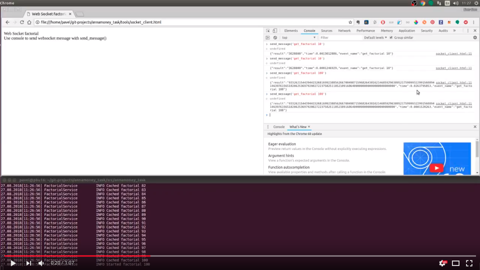

# anna.money Job challenge

[English language](README.md)

## Задание

Написать сервис, у которого  есть http метод для вычисления факториала,
результат вычислений должен приходить клиенту по websocket.

Язык реализации python. Выбор библиотек на усмотрение кандидата.


## Реализация

Сервер написан с использованием aiohttp + asyncio. Для ускорения вычисления факториала используется мемоизация,
при этом для того, чтобы математические вычисления не блокировали сервер, рекурсивные вызовы заменены на явное
ожидание результата в кеше и инициализацию сопрограммы вычисления факториала для для `n - 1`.

Требования: Python 3.7 или выше.


## Демо
[](https://youtu.be/pMMf_fhCPIo)


### Протокол

C - client, S - server

```
Общая схема:
    C -> {event} -> S
    C <- {event result} <- S

Пример:
    C -> "get_factorial 10" -> S
    C <- "{'event_name': 'get_factorial 10', 'result': '3628800', 'time': 0.0001189709}" <- S
```

### Команды
* `get_factorial N`
* `ping`


## Установка и запуск сервиса
Рекомендую создать виртуальное окружение с помощью `virtualenv` или `pyenv virtualenv` для установки сервиса. Далее:

```
$ pip install git@github.com:PavelBass/annamoney-task.git
$ annamoney_task run
```

Для справки: `$ annamoney_task run --help`


## Тесты и линтеры

Для запуска тестов и линтеров достаточно запустить `tox` в корне репозитория.
Примечание: `tox` необходимо прежде установить в ваше окружение, например командой
`pip install tox`
